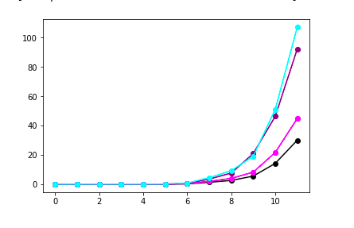
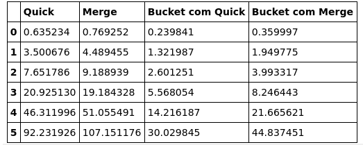
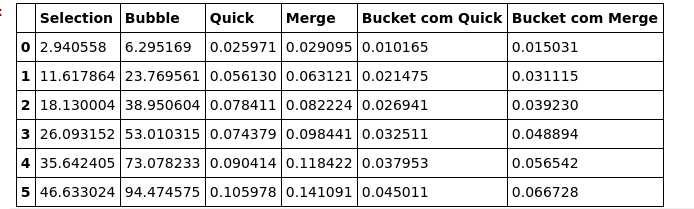

## Lista 3 - Algorítimos de Ordenação O(n log n)

### Alunos:

João Lucas Fragoso Zarbiélli - 170146251, Gabriel Filipe Manso Araujo - 160121019

### Sobre:

O trabalho se propõe a comparar algoritimos O(n²) com os O(n log n) como também comparar a execução entre os algoritimos O(n log n), sendo eles:

* Quick Sort 
* Bucket Sort
* Merge Sort 

Há algumas particularidades no Quick Sort e no Bucket Sort. No Quick foi usado a abordagem da mediana de três, que consiste em usar como pivo sempre o valor da mediana entre o primeiro, o último e o elemento do meio, assim evitando que ele caia no caso O(n²) quando o vetor estiver ordenado. Já no Bucket usamos dois algorítimos diferentes para ordenar os baldes, o Quick Sort e o Merge Sort e comparamos os tempo entre eles. Todas essas comparações estão registrada na sessão *BENCHMARKING*, assim como o gráficos de comportamento dos algoritimos com o aumento da quantidade de chaves organizadas.

Foram usados vetores de tamanho 100k, 500k, 1M, 2M, 5M e 10M para a geração de gráficos dos algorítimos O(n log n) e para os O(n²) foram usandos tamanhos de 5k, 10k, 12.5k, 15k, 17.5k e 20k. 

### Imagens:

#### Gráficos O(n log n)

#### Benchmark O(n log n)

#### Benchmark O(n log n) vs O(n²)

